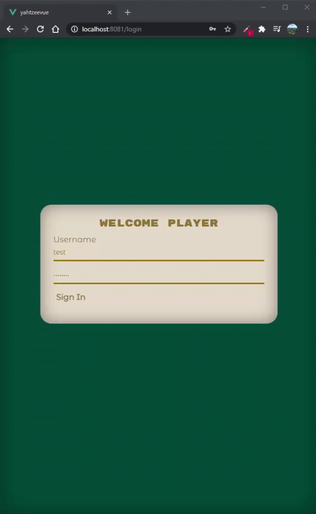
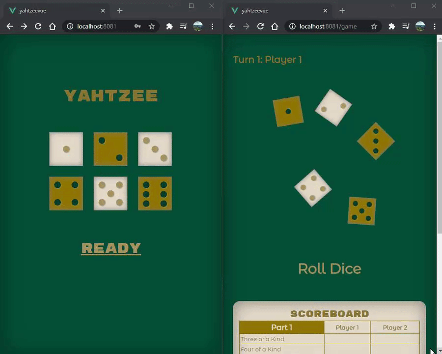

# YahtzeeVue

An application to play Yahtzee online with friends

## Description

YahtzeeVue is a Vue.js based multiplayer Yahtzee game, using websocktes as the communication. YahtzeeVue is connected to a small webserver written in Java, using STOMP and Spring Boot. The client is also connected to a REST api, using Spring Boot. This was my first interaction with websockets and it is developed for local use only. I know that beats the purpose of using websockets but it was a great exercise.
Currently it is still in development.

## Functionalities

### Registration



### Gameplay



## Project setup

```
npm install
```

### Compiles and hot-reloads for development

```
npm run serve
```

### Compiles and minifies for production

```
npm run build
```

### Lints and fixes files

```
npm run lint
```
